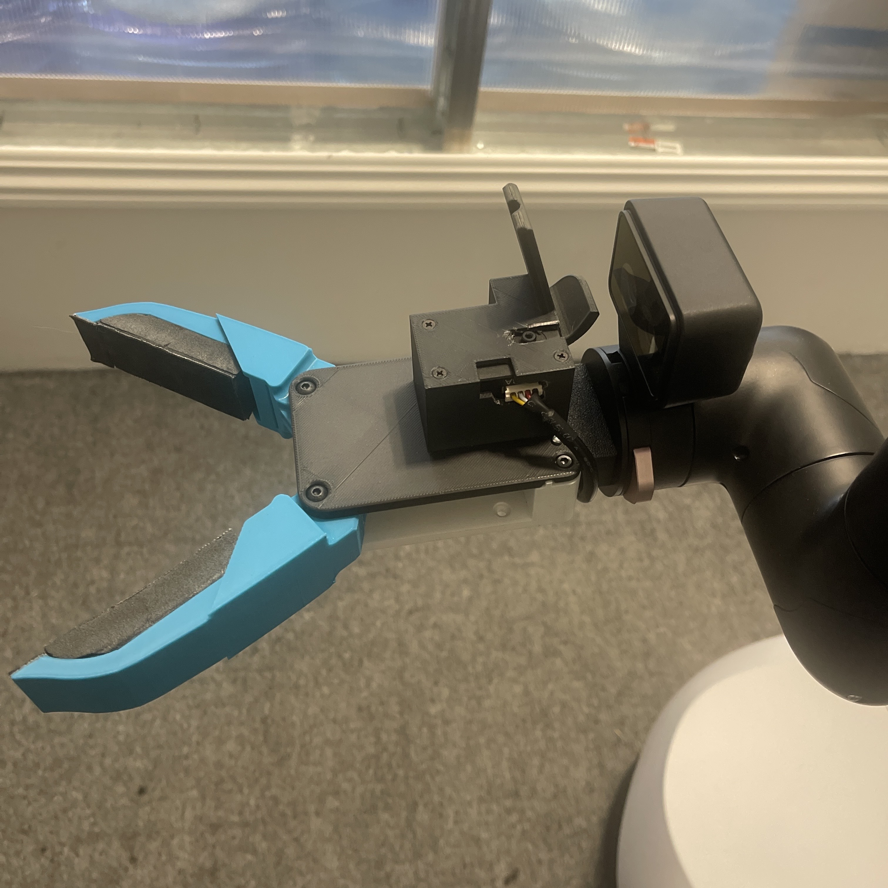

<p align="center">
  
</p>

# Stretch 4 Tool Share

Community-shared end-of-arm (EOA) tools for the Stretch 4 mobile manipulator from [Hello Robot](https://hello-robot.com). Each folder in this repository is a complete, robot-tested tool — drivers, URDF, meshes, and parameters — ready to install on your robot.

## Tool Gallery

| Image | Tool | Author | Description |
| --- | --- | --- | --- |
|  | [NYU Gripper](nyu_gripper/) | [NYU](https://nyu-gripper.pages.dev) | Tendon-driven parallel gripper for the DexWrist v4 — one Feetech servo winds a Kevlar tendon to close, spring-return opens |

## Installing a shared tool

1. Clone this repository onto your robot:

   ```bash
   git clone https://github.com/hello-bharadwaj/stretch4_tool_share.git
   ```

2. Copy the tool's folder into `~/stretch_user/user_tools/`:

   ```bash
   cp -r stretch4_tool_share/<tool_name> ~/stretch_user/user_tools/
   ```

3. Register the tool:

   ```bash
   stretch_add_user_tool <tool_name>
   ```

4. Activate it by selecting it from the tool list:

   ```bash
   stretch_configure_tool
   ```

5. Restart the body server:

   ```bash
   stretch_body_server --restart
   ```

Verify the installation:

1. Confirm all validation checks pass:

   ```bash
   stretch_add_user_tool <tool_name> --check
   ```

2. Jog the tool:

   ```bash
   stretch_gripper_jog
   ```

3. Check the tool appears and moves in the collision visualizer:

   ```bash
   stretch_collision_viz
   ```

Each tool's README may add tool-specific steps (bill of materials, servo configuration, homing caveats) — read it before installing.

## Building your own tool

New tools are scaffolded on the robot, not copied from existing ones:

```bash
stretch_add_user_tool my_tool_name
```

This generates `~/stretch_user/user_tools/my_tool_name/` with boilerplate drivers, an empty `tool.urdf`, and a `user_tool.md` reference guide documenting every file and the full authoring workflow. See also the official [Changing Tools](https://docs.hello-robot.com/stretch4_docs/working-with-stretch/common_tasks/changing-tools.md) documentation.

## Contributing

Built a tool the community could use? See [CONTRIBUTING.md](CONTRIBUTING.md), and consider announcing it on the [Stretch forum](https://forum.hello-robot.com/).

## License

This repository is licensed under the [Apache License 2.0](LICENSE). Attribution for each tool lives in its own README.
